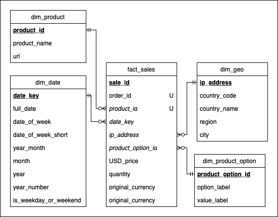

## Overview

Addressing fragmented business data, this project **automates ELT processes** and **constructs a centralized Data Warehouse**. It further **provides flexible analytics tools** and implements **data visualization via dashboards** to streamline data processing, enhance analysis quality, and **support data-driven business decisions**.

## 1. System Overview
A cloud-native ***ELT*** pipeline architecture integrates ***Data Source*** ingestion, ***Data Lake*** (GCS) raw data storage, ***Data Warehouse*** transformation via ***dbt*** for analytical modeling, and ***Looker Studio*** dashboards for actionable business intelligence.

## 2. Implementation Steps

The following steps outline the full lifecycle of the ***ELT pipeline***, from setup to monitoring.

### Step 1: Infrastructure Setup

- Initialize a new **Google Cloud Project** and enable necessary APIs.
- Create a **GCS bucket** to store raw and exported data.
- Launch a **Compute Engine VM** and install **MongoDB** for intermediate processing.
- Set up authentication and environment configuration.

### Step 2: Raw Data Ingestion & Preprocessing

- Upload raw data files **directly to the VM** using `gcloud compute scp`.
- **Split and import the data** into MongoDB in manageable chunks.
- Explore the initial dataset using **MongoDB Shell**.

### Step 3: Data Enrichment

- Use `ip2location-python` to enrich IPs with **geolocation attributes** (e.g., country, region, city).
- **Crawl and aggregate product metadata** from relevant user activity events.
- Store results in dedicated **MongoDB collections**.

### Step 4: Export & Load to BigQuery

- Export processed MongoDB collections to **GCS** in JSON format.
- Create a **BigQuery dataset** and define table schemas.
- Deploy a **Cloud Function** to trigger automatic loading upon new GCS uploads.

### Step 5: Data Modeling with dbt

- Set up and configure `dbt` to interface with BigQuery.
- Build layered models:
  - **Raw Layer** – structured source data
  - **Staging Layer** – standardized and cleaned
  - **Analytics Layer** – domain-specific aggregations
- Integrate tests, documentation, and lineage tracking.

### Step 6: Visualization with Looker Studio

- Connect Looker Studio to BigQuery.
- Develop interactive dashboards for business intelligence.
- Utilize filters, drill-downs, and time-based views for richer insights.

## 3. Data Lineage

This section illustrates ***how data flows through dbt models***, ensuring full transparency and traceability ***from raw ingestion to analytical outputs***.

## 4. Analytical Data Model

The architecture adopts a **star schema** structure, with a central **fact table** `fact_sales` capturing transactional data and referencing **conformed dimensions** for contextual **OLAP-style** querying.

